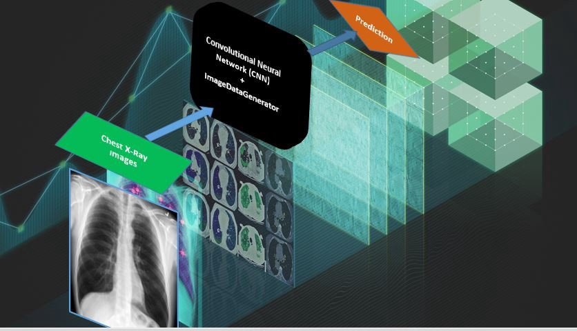

<!-- PROJECT LOGO -->
<br />
<p align="center">
  <a href="https://github.com/ctrl-gaurav/Pneumonia-Detection">
    
  </a>

  <h3 align="center">Pneumonia Detection</h3>

  <p align="center">
    Pneumonia Detection Using Various Neural Networks Architecture and using Transfer Learning on VGG16 as Pretrained Model
    <br />
    <a href="https://github.com/ctrl-gaurav/Pneumonia-Detection/blob/main/README.md"><strong>Explore the docs »</strong></a>
    <br />
    <br />
    <a href="https://github.com/ctrl-gaurav/Pneumonia-Detection">View Demo</a>
    ·
    <a href="https://github.com/ctrl-gaurav/Pneumonia-Detection/issues">Report Bug</a>
    ·
    <a href="https://github.com/ctrl-gaurav/Pneumonia-Detection/issues">Request Feature</a>
  </p>
</p>


## Table of Contents

- [Table of Contents](#table-of-contents)
- [About The Project](#about-the-project)
- [Built With](#built-with)
- [Getting Started](#getting-started)
  - [Prerequisites](#prerequisites)
  - [Installation](#installation)
- [Train Your Own Model](#train-your-own-model)
  - [Procedure](#procedure)
- [Product Screenshots](#product-screenshots)
- [Roadmap](#roadmap)
- [Contributing](#contributing)
- [License](#license)
- [Contact](#contact)


## About The Project

Pneumonia Detection Using Various Neural Networks Architecture and using Transfer Learning on VGG16 as Pretrained Model


## Built With

* [Keras](https://keras.io/)
* [Tensorflow](https://www.tensorflow.org/)
* [VGG16](https://keras.io/api/applications/vgg/)
* [scikit-learn](https://scikit-learn.org/stable/)
* [Flask](https://flask.palletsprojects.com/en/2.0.x/)


## Getting Started

To get a local copy up and running follow these simple example steps.


### Prerequisites

You will need:

- Python 
- Tensorflow 
- scikit-learn
- Flask


### Installation

1. Make sure you have python3 setup on your system
2. Clone the repo
```sh
git clone https://github.com/ctrl-gaurav/Pneumonia-Detection.git
```
3. Install requirements
```sh
pip install -r requirements.txt
```
4. [Download]() Pre-Trained Weights
4. Run app.py 
```sh
python app.py
```

## Train Your Own Model

If you want to train your own model

### Procedure

1. Make sure you have python3 setup on your system
2. Clone the repo
```sh
git clone https://github.com/ctrl-gaurav/Pneumonia-Detection.git
```
3. Install requirements
```sh
pip install -r requirements.txt
```
4. Read Documentation and see which model architecture you want to use or fit best for your model.
5. Set Parameters according to your dataset then :
6. Run model_2_1_architecture.py
```sh
python model_2_1_architecture.py
```
7. Run model_3_1_architecture.py
```sh
python model_3_1_architecture.py
```
8. Run model_4_2_architecture.py
```sh
python model_4_2_architecture.py
```
9. Your Trained Model is automatically saved in models folder
10. Change Your model name in app.py and then test your model
11. Run app.py 
```sh
python app.py
```


## Product Screenshots


## Roadmap

See the [open issues](https://github.com/ctrl-gaurav/Pneumonia-Detection/issues) for a list of proposed features (and known issues).


## Contributing

To add your contributions to this project follow these steps :

1. Fork the Project
2. Create your improvements Branch (`git checkout -b improvements/myimprovements`)
3. Commit your Changes (`git commit -m 'Done some Improvements'`)
4. Push to the Branch (`git push origin improvements/myimprovements`)
5. Open a Pull Request


## License

Distributed under the MIT License. See `LICENSE` for more information.


## Contact

- Gaurav 
  - Insta Handle - [@ig_itsgk](https://www.instagram.com/ig_itsgk/) 
  - LinkedIn - [Gaurav](https://www.linkedin.com/in/gaurav-726239157/) <br />
- Project Link: [https://github.com/ctrl-gaurav/Pneumonia-Detection](https://github.com/ctrl-gaurav/Pneumonia-Detection)


[screenshot1]: readme/nn.png