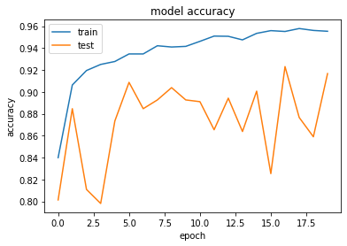
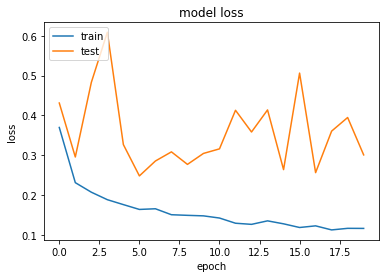
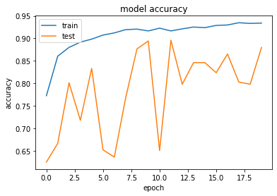
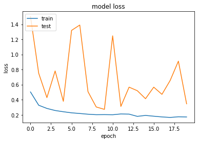
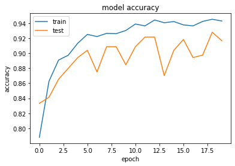
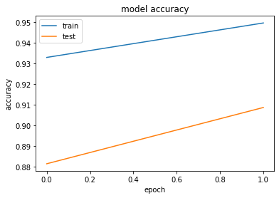
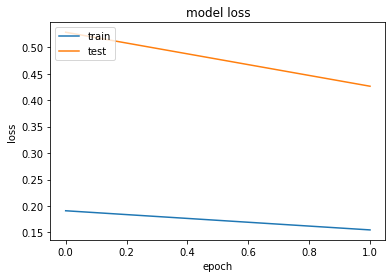

<!-- PROJECT LOGO -->
<br />
<p align="center">
  <a href="https://github.com/ctrl-gaurav/Pneumonia-Detection">
    
  </a>

  <h3 align="center">Pneumonia Detection</h3>

  <p align="center">
    Pneumonia Detection Using Various Neural Networks Architecture and using Transfer Learning on VGG16 as Pretrained Model
    <br />
    <a href="https://github.com/ctrl-gaurav/Pneumonia-Detection/blob/main/README.md"><strong>Explore the docs »</strong></a>
    <br />
    <br />
    <a href="https://github.com/ctrl-gaurav/Pneumonia-Detection">View Demo</a>
    ·
    <a href="https://github.com/ctrl-gaurav/Pneumonia-Detection/issues">Report Bug</a>
    ·
    <a href="https://github.com/ctrl-gaurav/Pneumonia-Detection/issues">Request Feature</a>
  </p>
</p>


## Table of Contents

- [Table of Contents](#table-of-contents)
- [About The Project](#about-the-project)
- [Built With](#built-with)
- [Getting Started](#getting-started)
  - [Prerequisites](#prerequisites)
  - [Installation](#installation)
- [Train Your Own Model](#train-your-own-model)
  - [Procedure](#procedure)
- [Product Screenshots](#product-screenshots)
- [Roadmap](#roadmap)
- [Contributing](#contributing)
- [License](#license)
- [Contact](#contact)


## About The Project

Pneumonia Detection Using Various Neural Networks Architecture and using Transfer Learning on VGG16 as Pretrained Model

Pneumonia is an infection that inflames the air sacs in one or both lungs. The air sacs may fill with fluid or pus (purulent material), causing cough with phlegm or pus, fever, chills, and difficulty breathing. A variety of organisms, including bacteria, viruses and fungi, can cause pneumonia.

The project is about diagnosing pneumonia from XRay images of lungs of a person using self laid convolutional neural network and tranfer learning via inceptionV3 and VGG16. 


## Using Various Neural Network Architecture

### Model 1

**Architecture :**
<ul>
  <li>ReLU Activation</li>
  <li>adam optimzer</li>
</ul>

<br>

<div class="row">
  <div class="column">
    
  </div>
  <div class="column">
    
  </div>
</div>

### Model 2

**New architecture with improving the previous architecture**
<ul>
  <li>ReLU Activation</li>
  <li>SGD optimzer</li>
  <li>Dropout + Batch Normalization</li>
</ul>

<br>

<div class="row">
  <div class="column">
    
  </div>
  <div class="column">
    
  </div>
</div>

### Model 3

**3 Hidden Layers**
<ul>
  <li>ReLU Activation</li>
  <li>RMSprop optimzer</li>
  <li>Dropout</li>
  <li>Model Architecture: 784-512-364-128-10</li>
</ul> 

<br>

<div class="row">
  <div class="column">
    
  </div>
  <div class="column">
    
  </div>
</div>


<h1>Conclusion</h1>
<html>
<body>
    <br>
    <b>Here are the results of our three models :</b>
    <br> 
<table border=1>
  <tr>
    <th>Model</th>
    <th>Architecture</th>
    <th>Training Accuracy</th>
    <th>Test Accuracy</th>
  </tr>
  <tr>
    <td>Model 1</td>
    <td>2:1 Arcitecture without using Batch Normalization and Dropout</td>
    <td>95.48%</td>
    <td>91.67%</td>
  </tr>
  <tr>
    <td>Model 2</td>
    <td>4:2 Achitecture using Batch Normalization and Dropout</td>
    <td>93.58%</td>
    <td>87.98%</td>
  </tr>
  <tr>
    <td>Model 3</td>
    <td>3:1 Convolutional layer</td>
    <td>94.74%</td>
    <td>91.67%</td>
  </tr>
</table>
</body>
</html>

## Transfer Learning VGG 16 and VGG 19 using Keras

<div class="row">
  <div class="column">
    
  </div>
  <div class="column">
    
  </div>
</div>

<h1>Conclusion</h1>
<html>
<body>
    <br>
    <b>Here are the results of Transfer Learning :</b> 
    <br>
<table border=1>
  <tr>
    <th>Model</th>
    <th>Architecture</th>
    <th>Training Accuracy</th>
    <th>Test Accuracy</th>
  </tr>
  <tr>
    <td>VGG 16</td>
    <td>Epoch = 2 Batch size = 10</td>
    <td>95.24%</td>
    <td>90.87%</td>
  </tr>
</table>
</body>
</html>


## Built With

* [Keras](https://keras.io/)
* [Tensorflow](https://www.tensorflow.org/)
* [VGG16](https://keras.io/api/applications/vgg/)
* [scikit-learn](https://scikit-learn.org/stable/)
* [Flask](https://flask.palletsprojects.com/en/2.0.x/)


## Getting Started

To get a local copy up and running follow these simple example steps.


### Prerequisites

You will need:

- Python 
- Tensorflow 
- scikit-learn
- Flask


### Installation

1. Make sure you have python3 setup on your system
2. Clone the repo
```sh
git clone https://github.com/ctrl-gaurav/Pneumonia-Detection.git
```
3. Install requirements
```sh
pip install -r requirements.txt
```
4. [Download]() Pre-Trained Weights
4. Run app.py 
```sh
python app.py
```

## Train Your Own Model

If you want to train your own model

### Procedure

1. Make sure you have python3 setup on your system
2. Clone the repo
```sh
git clone https://github.com/ctrl-gaurav/Pneumonia-Detection.git
```
3. Install requirements
```sh
pip install -r requirements.txt
```
4. Read Documentation and see which model architecture you want to use or fit best for your model.
5. Set Parameters according to your dataset then :
6. Run model_2_1_architecture.py
```sh
python model_2_1_architecture.py
```
7. Run model_3_1_architecture.py
```sh
python model_3_1_architecture.py
```
8. Run model_4_2_architecture.py
```sh
python model_4_2_architecture.py
```
9. Your Trained Model is automatically saved in models folder
10. Change Your model name in app.py and then test your model
11. Run app.py 
```sh
python app.py
```


## Product Screenshots


## Roadmap

See the [open issues](https://github.com/ctrl-gaurav/Pneumonia-Detection/issues) for a list of proposed features (and known issues).


## Contributing

To add your contributions to this project follow these steps :

1. Fork the Project
2. Create your improvements Branch (`git checkout -b improvements/myimprovements`)
3. Commit your Changes (`git commit -m 'Done some Improvements'`)
4. Push to the Branch (`git push origin improvements/myimprovements`)
5. Open a Pull Request


## License

Distributed under the MIT License. See `LICENSE` for more information.


## Contact

- Gaurav 
  - Insta Handle - [@ig_itsgk](https://www.instagram.com/ig_itsgk/) 
  - LinkedIn - [Gaurav](https://www.linkedin.com/in/gaurav-726239157/) <br />
- Project Link: [https://github.com/ctrl-gaurav/Pneumonia-Detection](https://github.com/ctrl-gaurav/Pneumonia-Detection)


[screenshot1]: readme/model_1_accuracy.png
[screenshot2]: readme/model_1_loss.png
[screenshot3]: readme/model_2_accuracy.png
[screenshot4]: readme/model_2_loss.png
[screenshot5]: readme/model_3_accuracy.png
[screenshot6]: readme/model_3_loss.png